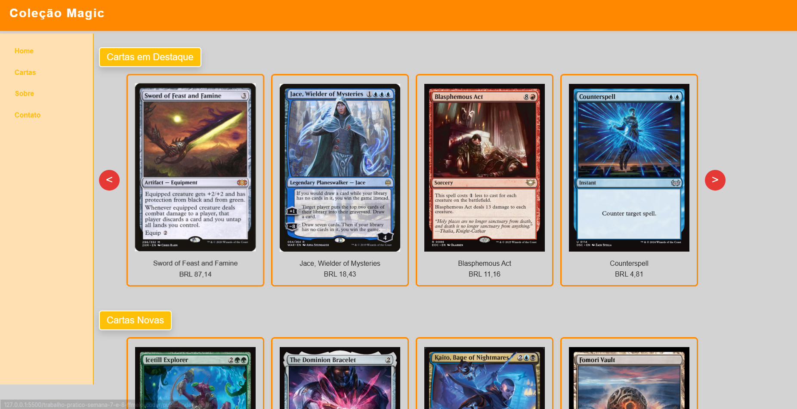
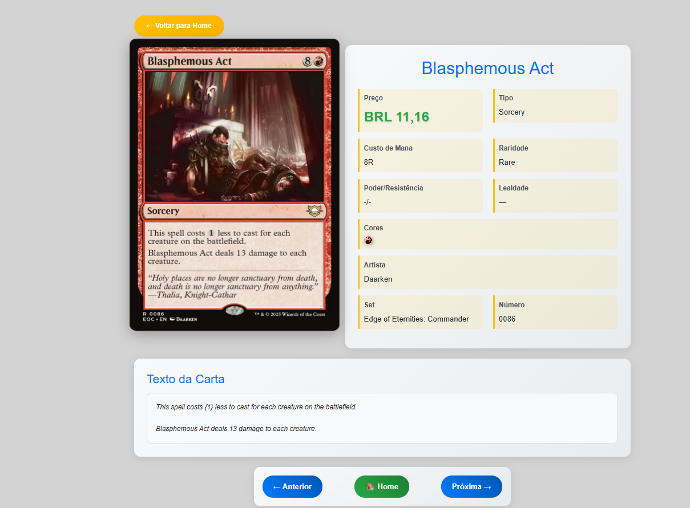

# Coleção Magic - Trabalho Prático Semanas 7 e 8

**Páginas de detalhes dinâmicas**

Nessa etapa, vamos evoluir o trabalho anterior, acrescentando a página de detalhes, conforme o  projeto escolhido. Imagine que a página principal (home-page) mostre um visão dos vários itens que existem no seu site. Ao clicar em um item, você é direcionado pra a página de detalhes. A página de detalhe vai mostrar todas as informações sobre o item do seu projeto. seja esse item uma notícia, filme, receita, lugar turístico ou evento.

Leia o enunciado completo no Canvas.

**IMPORTANTE:** Assim como informado anteriormente, capriche na etapa pois você vai precisar dessa parte para as próximas semanas.

**IMPORTANTE:** Você deve trabalhar e alterar apenas arquivos dentro da pasta **`public`,** mantendo os arquivos **`index.html`**, **`styles.css`** e **`app.js`** com estes nomes, conforme enunciado. Deixe todos os demais arquivos e pastas desse repositório inalterados. **PRESTE MUITA ATENÇÃO NISSO.**

## Informações Gerais

- Nome:
- Matricula:
- Proposta de projeto escolhida:
- Breve descrição sobre seu projeto:

## Print da Home-Page



## Print da página de detalhes do item



## Cole aqui abaixo a estrutura JSON utilizada no app.js

```javascript
// Dados das cartas Magic
const cartas = [
  {
    id: 1,
    nome: "Sword of Feast and Famine",
    preco: "BRL 87,14",
    descricao: "Artifact — Equipment",
    custoMana: "3",
    cores: ["incolor"],
    raridade: "Mythic Rare",
    categoria: "Destaque",
    imagem: "img/cartas/sword-of-feast-and-famine.jpg",
    detalhes: {
      poder: "-",
      resistencia: "-",
      texto:
        "Equipped creature gets +2/+2 and has protection from black and from green.\n\nWhenever equipped creature deals combat damage to a player, that player discards a card and you untap all lands you control.\n\nEquip {2}",
      artista: "Chris Rahn",
      set: "Double Masters",
      numero: "296/332",
    },
  },
  {
    id: 2,
    nome: "Jace, Wielder of Mysteries",
    preco: "BRL 18,43",
    descricao: "Legendary Planeswalker — Jace",
    custoMana: "1UUU",
    cores: ["azul"],
    raridade: "Rare",
    categoria: "Destaque",
    imagem: "img/cartas/war-54-jace-wielder-of-mysteries.jpg",
    detalhes: {
      poder: "-",
      resistencia: "-",
      lealdade: "4",
      texto:
        "If you would draw a card while your library has no cards in it, you win the game instead.\n\n+1: Target player mills two cards. Draw a card.\n\n−8: Draw seven cards. Then if your library has no cards in it, you win the game.",
      artista: "Anna Steinbauer",
      set: "War of the Spark",
      numero: "54/264",
    },
  },
  {
    id: 3,
    nome: "Blasphemous Act",
    preco: "BRL 11,16",
    descricao: "Sorcery",
    custoMana: "8R",
    cores: ["vermelho"],
    raridade: "Rare",
    categoria: "Destaque",
    imagem: "img/cartas/eoc-86-blasphemous-act.jpg",
    detalhes: {
      poder: "-",
      resistencia: "-",
      texto:
        "This spell costs {1} less to cast for each creature on the battlefield.\n\nBlasphemous Act deals 13 damage to each creature.",
      artista: "Daarken",
      set: "Edge of Eternities: Commander",
      numero: "0086",
    },
  },
  {
    id: 4,
    nome: "Counterspell",
    preco: "BRL 4,81",
    descricao: "Instant",
    custoMana: "UU",
    cores: ["azul"],
    raridade: "Uncommon",
    categoria: "Destaque",
    imagem: "img/cartas/dsc-114-counterspell.jpg",
    detalhes: {
      poder: "-",
      resistencia: "-",
      texto: "Counter target spell.",
      artista: "Zack Stella",
      set: "Duskmourn: House of Horror Commander",
      numero: "0114",
    },
  },
  {
    id: 5,
    nome: "Icetill Explorer",
    preco: "BRL 68,69",
    descricao: "Creature — Insect Scout",
    custoMana: "2G",
    cores: ["verde"],
    raridade: "Rare",
    categoria: "Nova",
    imagem: "img/cartas/eoe-192-icetill-explorer.jpg",
    detalhes: {
      poder: "2",
      resistencia: "4",
      texto:
        "You may play an additional land on each of your turns.\n\nYou may play lands from your graveyard.\n\nLandfall — Whenever a land you control enters, mill a card.",
      artista: "Warren Mahy",
      set: "Edge of Eternities",
      numero: "0192",
    },
  },
  {
    id: 6,
    nome: "The Dominion Bracelet",
    preco: "BRL 17,99",
    descricao: "Legendary Artifact - Equipment",
    custoMana: "2",
    cores: ["incolor"],
    raridade: "Mythic Rare",
    categoria: "Nova",
    imagem: "img/cartas/eoe-239-the-dominion-bracelet.jpg",
    detalhes: {
      poder: "-",
      resistencia: "-",
      texto:
        'Equipped creature gets +1/+1 and has "{15}, Exile The Dominion Bracelet: You control target opponent during their next turn. This ability costs {X} less to activate, where X is this creature\'s power. Activate only as a sorcery."\n\nEquip {1}',
      artista: "Nathaniel Himawan",
      set: "Edge of Eternities",
      numero: "0239",
    },
  },
  {
    id: 7,
    nome: "Kaito, Bane of Nightmares",
    preco: "BRL 179,49",
    descricao: "Legendary Planeswalker — Kaito",
    custoMana: "2UB",
    cores: ["azul", "preto"],
    raridade: "Mythic Rare",
    categoria: "Nova",
    imagem: "img/cartas/dsk-220-kaito-bane-of-nightmares.jpg",
    detalhes: {
      poder: "-",
      resistencia: "-",
      lealdade: "4",
      texto:
        'Ninjutsu {1}{U}{B} ({1}{U}{B}, Return an unblocked attacker you control to hand: Put this card onto the battlefield from your hand tapped and attacking.)\n\nDuring your turn, as long as Kaito has one or more loyalty counters on him, he\'s a 3/4 Ninja creature and has hexproof.\n\n+1: You get an emblem with "Ninjas you control get +1/+1."\n\n0: Surveil 2. Then draw a card for each opponent who lost life this turn.\n\n−2: Tap target creature. Put two stun counters on it.',
      artista: "Joshua Raphael",
      set: "Duskmourn: House of Horror",
      numero: "220",
    },
  },
  {
    id: 8,
    nome: "Fomori Vault",
    preco: "BRL 49,90",
    descricao: "Land",
    custoMana: "",
    cores: ["incolor"],
    raridade: "Rare",
    categoria: "Nova",
    imagem: "img/cartas/big-29-fomori-vault.jpg",
    detalhes: {
      poder: "-",
      resistencia: "-",
      texto:
        "Fomori Vault enters the battlefield tapped.\n\n{T}: Add {C}.\n\n{3}, {T}, Exile Fomori Vault: Exile the top card of your library. Until end of turn, you may play that card.",
      artista: "Jonas de Ro",
      set: "The Big Score",
      numero: "29/30",
    },
  },
];
```
